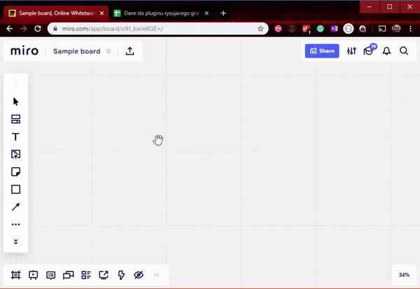
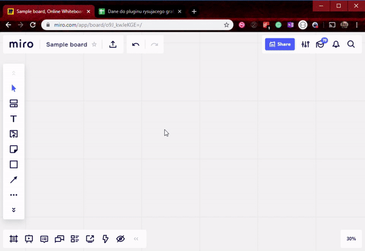

# Plugin for Miro - import charts

This plugin allows to easily import charts from spreadsheets/tables into Miro. 

### Currently supported charts
 Org chart
 


Gantt chart




## Installation
[CLICK HERE](https://miro.com/oauth/authorize/?response_type=token&client_id=3074457347050462782&redirect_uri=https://kaszaq.github.io/miro-chart-importer/installComplete.html) to install plugin in Miro.

## Sample data

Sample data to play around with this plugin is available [here](https://docs.google.com/spreadsheets/d/1Sw2g8WMVEoN1WZcd3oco1MXBeZVRDkFr__USVw8HF4Y/edit?usp=sharing)

## Why

There are types of charts that once created you wish to modify them, change they way they look, adjust a little. On daily basis you have this data in spreadsheet or at least you can export it into spreadsheets.
However it is not as simple then to draw them all. For instance the way you can adjust org chart in Google Sheets is almost non existant. With Miro you do not have those limitations however importing this data might be 
very time consuming.

With this plugin it is possible to import this data into Miro and automatically convert it into initial charts you can later on adjust to your needs.

## Use case

* To simplify creation of charts in Miro that would take otherwise a lot time to recreate.
* To have a simple way of adjusting in Miro the UX of charts where other tools, like spreadsheets, fail.

Note: some charts that could be added to this plugin, for instance line chart, might actually not have too high value when for instance google spreadsheets create quite nice and sufficient to most use cases graphs like that and user could just copy paste the image of such graph into Miro.

## Known issues & upcoming features
There are some ideas for features, some known issues, some features actually require updates on Miro side.

#### Features
* zoom to graph once the graph is created
* graphs of nodes chart with links between them. Good to draw dependencies between systems or any other linked graphs. This was actually the initial idea but is not yet added.
* export back into spreadsheets 
* family tree
* pie chart based on triangles. However the value of this might be low as user could as easily create such graph in Google spreadsheet and copy paste it into Miro.

#### Issues
* progress bar for not yet fully known reason doesn't update as expected. This has to do something most likely with async/sync calls. This might very likely get removed as is causing more issues and Miro notifications could be used instead.
* the pictures of Gantt and org chart in menu could be more aligned with Miro UX

#### Tech debt
* mixed technologies, ie. sometimes pur js, sometimes jquery

#### Issues/features that require Miro fixes / features implementation
* authentication doesn't work as expected. Even when user is authenticated he is forced to reload the board. With multiple plugins that would require such action from the user it could be a bad UX.
* the efficiency of widget creation is visibly different between creating them via SDK and comparing to how fast they are created when done by Miro itself [for instance templates drop or copy pasting hundreds of objects]. Via SDK, as visible on pictures on top, creation of those widgets is really slow and impacts UX of this plugin
* starting and endpoint points of lines cannot be set via SDK. 
  * Because of that it is impossible to draw nice org chart with lines. Until this gets added to SDK, the org chart will remain not as pretty as initially planned.
  * Also impossible to draw dependencies in Gantt
* drawing lines without prior objects creation. Because of this requirement it currently takes a lot of time to draw a lines between objects as it is required to await for widgets which will get linked by that line to be created beforehand
* if it would be possible to draw lines without need of linking objects then it would be possible to draw line charts which is currently not possible.
* there seem to be some issues with data broadcast handling. This is to be expected as this is an experimental feature. Sometimes it seems as if some **data broadcast** events are not being received by the iframes. In logs there are visible errors due to channels lost, however it is quite hard to debug.
* iframes for some reason get ?disconnected? from each other, hence they stop working
* plugin implements its own "loading" bar. Would rather this be replaced with something out of the box, but I guess the value for this might be quite low
* right triangles would allow to draw more sophisticated shapes. Apart from allowing to draw stacked/filled lines charts, these would actually allow to fill shapes drawn by hand by users. The best would of course be triangles created from the code by providin 3 points ;)
* throttling of widgets creation in this plugin should be updated once response from Miro dev team is given about actual limits of SDK calls
* it is very complicated to put a text aligned to an object as we do not know its width until it is created. The workaround is to either use big number for width you expect user wont go over, or create, check width and adjust in 2nd step. Would be easier if it was somehow possible via the api to put a text at x that starts from "that" point and from that point the text should appear either on left or right side of it.

  The workaround that will place the TEXT widget at correct aligned to something looks as follows
  ```javascript
  let x=...;
  let y=...;
  miro.board.widgets.update((await miro.board.widgets.create({type:"TEXT", x:x-60.5, y:y, text: "Some sample text", clientVisible:false})).map(widget => {return {id:widget.id, x:widget.x+widget.width/2, clientVisible:true}}));```
* text widget when created is for some reason moved on **x axis** 60.5 plus vs the requested `x` position during creation. This makes it a dangerous choice is it is unknown whether this is a bug and whether this can be compensated inside the code.
    